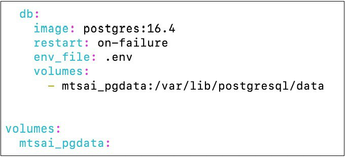

# Аннотация

Документ «Руководство администратора» предназначен для сотрудников эксплуатирующей организации и отражает основную функциональность и порядок действий при выполнении операций, связанных с администрированием системы Kodify.

# Перечень терминов

- **Искусственный интеллект** – область компьютерных наук, занимающаяся созданием вычислительных систем, способных выполнять задачи, требующие человеческого интеллекта, такие как восприятие, рассуждение, обучение и решение проблем.
- **Машинное обучение** – раздел искусственного интеллекта, в котором вычислительные системы обучаются выполнять задачи, анализируя и обобщая данные. Обучение происходит без явного программирования специфических инструкций.
- **Генеративные модели** – типы искусственного интеллекта, способные создавать новый контент, включая тексты, изображения и музыку. Такие модели обучаются на больших объемах данных и затем генерируют новый контент, имитируя наблюдаемые данные.
- **Дообучение (Fine-tuning)** – процесс настройки предобученной модели под конкретную задачу путем дополнительного обучения на более мелком и специфическом наборе данных.
- **Нейронная сеть** – математическая модель, состоящая из взаимосвязанных искусственных нейронов, организованных в слои, предназначенная для выполнения задач машинного обучения и обработки данных.
- **Токен** – минимальная единица текста, например, слово или символ. Применяется в обработке естественного языка для анализа и генерации текста.
- **Docker** – платформа для автоматизации развёртывания вычислительных приложений в контейнерах. Обеспечивает изоляцию приложений и независимость от среды выполнения.

# Перечень сокращений

- **API (Application Programming Interface)** - набор правил и инструментов для взаимодействия программного обеспечения. API предоставляет возможность различным приложениям обмениваться данными и функциональностью.
- **JSON (JavaScript Object Notation)** – лёгкий формат обмена данными. Формат легко читается человеком и парсируется компьютером.
- **NLP** – область искусственного интеллекта, занимающаяся взаимодействием между компьютерами и людьми на естественных языках, таких как русский или английский.
- **AI (Artificial Intelligence)** – это интеллект, демонстрируемый машинами, в частности компьютерными системами.
- **ПО** – программное обеспечение.
- **LLM (Large Language Model)** – это языковая модель, состоящая из нейронной сети со множеством параметров.
- **UI (User Interface)** – пользовательский интерфейс.
- **IDE (Integrated Development Environment)** - программа, в которой разработчики пишут, проверяют, тестируют и запускают код, а также ведут большие проекты.

# 1 Введение

Настоящий документ представляет собой руководство администратора (далее руководство) системы Kodify.

Руководство описывает:
- общее определение системы;
- функции системы;
- описание взаимодействия сервисов системы;
- требования к уровню подготовки администратора системы;
- программные и аппаратные требования для работы с системой;
- установку и настройку системы.

## 1.1 Назначение системы и ее состав

### 1.1.1 Назначение системы

Kodify от МТС AI представляет собой AI-ассистента разработчика. Этот инструмент использует искусственный интеллект для автоматизации рутинных процессов и помощи разработчикам в выполнении различных задач при написании программного кода. 

Система предназначена для облегчения процесса разработки, предоставляя инструменты для генерации кода, улучшения его качества и автоматизации рутинных задач. Kodify поддерживает различные языки программирования (например, Python, C#, Java, Go, JavaScript) и интеграции с популярными инструментами разработки.

### 1.1.2 Сервисы Kodify

Система Kodify состоит из следующих сервисов:

**Таблица 1**. Сервисы Kodify.

| Сервис  | Описание | 
|-------|-----|
|Плагин для установки в IDE | Плагин представляет собой пользовательский интерфейс для взаимодействия с Kodify. Поддерживается плагин для JetBrains и Visual Studio Code.  |
| API Сервер   | Сервер для взаимодействия с LLM моделью через REST API. |
| Model Server (vLLM) | Сервис для инференса LLM модели и ее хранения. |
| PostgreSQL | БД с данными об учетной записи пользователей, используемая для пользовательской авторизации и журналирования. При иных типах авторизации -  не используется. |

### 1.1.3 Описание взаимодействия сервисов

На следующей схеме показано взаимодействие сервисов Kodify.


Kodify представляет собой LLM и плагин, встраиваемый в IDE от JetBrains (например, PyCharm) и Visual Studio Code. Взаимодействие пользователя с LLM Kodify осуществляется через пользовательский интерфейс (UI) в виде плагина. Плагин содержит набор функций для упрощения и ускорения процесса написания кода за счёт обращения к LLM. 

Kodify предоставляет REST API (API сервер), к которому обращается плагин, установленный в IDE. Далее запрос отправляется на обработку LLM-моделью в Model Server. 

## 1.2 Краткое описание функций

Система Kodify поставляется со следующими функциями:
- Автопродление кода с помощью LLM, которая на основе уже написанного пользователем кода генерирует завершение строки.
- Документирование кода
- Поиск ошибок в коде и исправление найденных ошибок.
- Формирование Unit-тестов для кода пользователя.
- Объяснение кода.

## 1.3 Требования к уровню подготовки

Требования к подготовке администратора:
- высокий уровень квалификации;
- наличие практического опыта выполнения работ по установке, настройке и администрированию программных и технических средств.

## 1.4 Перечень эксплуатационной документации

Ниже представлен список пользовательской документации системы:
- Руководство администратора системы Kodify
- Руководство пользователя системы Kodify.

# 2 Условия применения системы

## 2.1 Требования к программному обеспечению 

Для работы системы необходимо, чтобы выполнялись следующие требования к программному обеспечению:

**Таблица 2.** Требования к программному обеспечению.

| Ресурс  | Требования | 
|-------|-----|
|Операционная система | Linux: Ubuntu или Astra Linux |
|Рекомендованная ОС | Ubuntu 24.04 LTS (Noble Numbat) ›<br> Ubuntu 22.04.4 LTS (Jammy Jellyfish) › <br> Ubuntu 20.04.6 LTS (Focal Fossa) <br> Oracle Linux <br> Поддерживается работа на Astra Linux |
|Docker  | Docker version 24.0.4+ <br> Kubernetes 1.24+ |
|Nvidia-Docker | [NVIDIA Container Toolkit](https://docs.nvidia.com/datacenter/cloud-native/container-toolkit/latest/install-guide.html) <br> NVIDIA Driver версия 525.105.17+ <br> CUDA версия 12.0+ |
|Интернет  | Наличие доступа к Интернет для скачивания образов при установке сервиса. Для работы сервиса доступ к Интернет не требуется. |

## 2.2 Требования к аппаратному обеспечению 

Для работы системы необходимо, чтобы выполнялись следующие требования к аппаратным ресурсам:

**Таблица 3**. Требования к аппаратному обеспечению.

| Ресурс  | Требования | 
|-------|-----|
|CPU  | от 8-16 ядер, процессор с наибольшей one thread скоростью |
|RAM | от 28 GB |
|GPU   | минимум 20 Gb, рекомендовано - 40-80 GB. A100 40/80Gb / H100 80Gb |
|SSD | 100 GB  - 1 TB  |

# 3 Установка системы

Для установки системы в собственной инфраструктуре, выполните следующие шаги:

## 3.1 Скачайте файлы и авторизуйтесь в Artifactory

Скачайте файлы *docker-compose* или *compose*, *ENV-файл* и *config.yml* - при наличии. Вам будут переданы логин и пароль от учетной записи Artifactory.

Перейдите по ссылке [https://artifactory.mts.ai/ui/login/](https://artifactory.mts.ai/ui/login/) и пройдите аутентификацию, используя полученные учётные данные. Ссылку на папку с вашим образом вам предоставят отдельно.

Поместите скачанные файлы в желаемую директорию.

## 3.2 Проверьте и сконфигурируйте ENV-файл, docker-compose и config.yml файлы

Ознакомьтесь с содержимым *ENV-файла*, который передан вместе с *docker-compose* и *config.yml* файлами. *ENV-файл* содержит значения переменных окружения. При необходимости, сконфигурируйте переменные. 

Подробнее о переменных окружения смотрите в разделе 4 - [Проверка и конфигурация ENV-файла](# 4 - Проверка и конфигурация ENV-файла).

Также проверьте заполнение *docker-compose* файла. Все переменные должны быть заполнены как на скриншоте ниже. Редактировать можно только переменную *ports*, если вы хотите указать иной адрес для приложения.


> Файл *config.yml* необходимо добавить в директорию /opt/mtsai, которую перед этим нужно создать.
Вы также можете указать путь до *config.yml() в текущей директории:<br>
volumes: <br> ./config.yml:/vllm-workspace/config.yml

При использовании пользовательской авторизации (ENV-переменная  MTSAI_AUTH=true и AUTH_TYPE=DB), вы можете развернуть базу данных PostgreSQL (работает на версии 16.4, но нет жестких требований к версии) одновременно с сервисом, используя Docker Compose. Для этого добавьте в *docker-compose.yml* сервис базы данных:



> Volume (mtsai_pgdata) обеспечивает сохранность данных базы между перезапусками контейнера. Данные будут храниться в директории /var/lib/postgresql/data внутри контейнера и будут доступны после остановки и удаления контейнера.

В *ENV-файл* для сервиса базы данных добавьте переменную окружения:

`POSTGRES_PASSWORD=<CHANGE THIS>`

При развертывании системы на нескольких видеокартах, добавьте в *docker-compose.yml* дополнительный параметр:

`shm_size: 10g`

Где `shm_size` - размер RAM памяти, которая хранит в себе промежуточные данные работы LLM, используемые в параллельных процессах на разных GPU.
Необходимый размер `shm_size` может варьироваться в зависимости от используемой LLM, количества GPU и других факторов. Рекомендуется установить значение `shm_size` равным 10g.

**Настройка модели для tabby запросов**

Для отправки запросов к модели в формате tabby, укажите в *config.yml* ключ `tabby`, у которого вы можете указать вложенный ключ `model_name`. В `model_name` укажите имя модели. 

```
tabby:
   model_name: tabby_model_name
```

По умолчанию, запросы в формате tabby обрабатываются первой моделью в списке upstreams в файле *config.yml*. В случае, когда API-сервер обслуживает несколько моделей и требуется указать какая именно модель будет обрабатывать запросы tabby, вы можете указать имя модели в ` tabby.model_name`.

```
upstreams:
   http://upstream1:8000:
   http://upstream2:8000:
tabby:
   model_name: tabby_model_name
```

## 3.3 Залогиньтесь в Artifactory 

Залогиньтесь в Artifactory с использованием вашей учетной записи через команду:

```
docker login artifactory.mts.ai
```

## 3.4 Мигрируйте БД (опционально)

Актуально в том случае, если планируется использовать журналирование (значение переменной `LOGS` в *ENV-файле* - "True"). Если журналирование отключено, то данный этап можно пропустить и перейти к следующему шагу.

Для выполнения миграции БД, установите  переменную окружения в ENV-файле `RUN_MIGRATIONS` в значение "1".

Если приложение эксплуатируется в среде Kubernetes, создайте init-контейнер с тем же образом, что и в основном контейнере сервиса. В нём используйте команду: 

```
alembic -c /vllm-workspace/middleware/gpt_logger/alembic.ini upgrade head
```
Для подключения к БД укажите  переменные окружения. Подробнее о переменных смотрите в разделе - [4.3 Переменные базы данных](#4.3 - Переменные базы данных).

## 3.5 Запустите контейнер

Запустите контейнер с помощью команды:

```
docker compose up -d 
```

Убедитесь, что у вас установлен Docker Compose.

## 3.6 Проверьте работу системы
Проверьте, что система работает корректно одним из следующих способов:

1. С помощью API-запроса `GET/health`. 

2. Откройте логи контейнера с помощью команды:

   ```
   docker logs CONTAINER_ID 
   ```

При успешной установке приложения в логах отобразится следующее:

```
INFO: Application startup complete/
INFO: Unicorn running on http://. . . . .
```

# 4 Проверка и конфигурация ENV-файла

Вместе с *docker-compose* файлом вам будет передан *ENV-файл*, который содержит значения переменных окружения. В файле вы можете задать или изменить переменные, указанные ниже.

## 4.1 Переменные потребления видеопамяти

