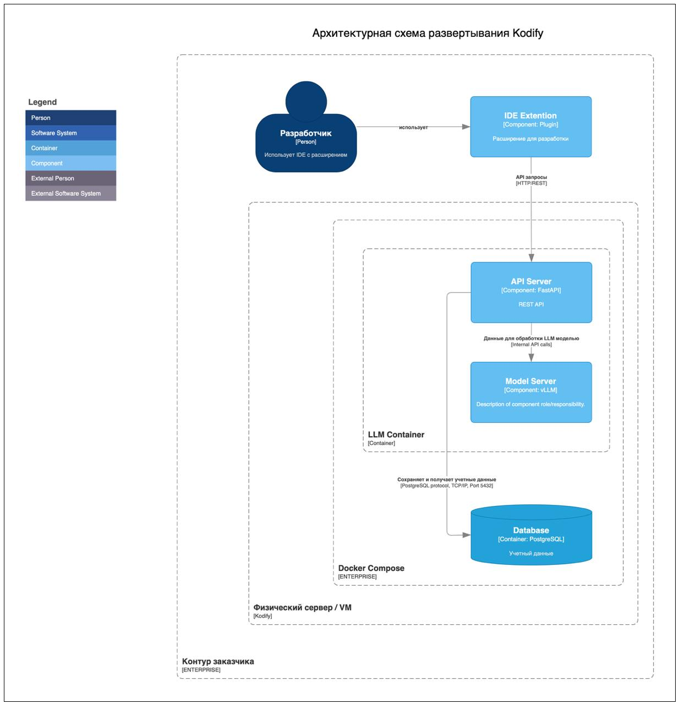

# Аннотация

Документ «Руководство администратора» предназначен для сотрудников эксплуатирующей организации и отражает основную функциональность и порядок действий при выполнении операций, связанных с администрированием системы Kodify.

# Перечень терминов

- **Искусственный интеллект** – область компьютерных наук, занимающаяся созданием вычислительных систем, способных выполнять задачи, требующие человеческого интеллекта, такие как восприятие, рассуждение, обучение и решение проблем.
- **Машинное обучение** – раздел искусственного интеллекта, в котором вычислительные системы обучаются выполнять задачи, анализируя и обобщая данные. Обучение происходит без явного программирования специфических инструкций.
- **Генеративные модели** – типы искусственного интеллекта, способные создавать новый контент, включая тексты, изображения и музыку. Такие модели обучаются на больших объемах данных и затем генерируют новый контент, имитируя наблюдаемые данные.
- **Дообучение (Fine-tuning)** – процесс настройки предобученной модели под конкретную задачу путем дополнительного обучения на более мелком и специфическом наборе данных.
- **Нейронная сеть** – математическая модель, состоящая из взаимосвязанных искусственных нейронов, организованных в слои, предназначенная для выполнения задач машинного обучения и обработки данных.
- **Токен** – минимальная единица текста, например, слово или символ. Применяется в обработке естественного языка для анализа и генерации текста.
- **Docker** – платформа для автоматизации развёртывания вычислительных приложений в контейнерах. Обеспечивает изоляцию приложений и независимость от среды выполнения.

# Перечень сокращений

- **API (Application Programming Interface)** - набор правил и инструментов для взаимодействия программного обеспечения. API предоставляет возможность различным приложениям обмениваться данными и функциональностью.
- **JSON (JavaScript Object Notation)** – лёгкий формат обмена данными. Формат легко читается человеком и парсируется компьютером.
- **NLP** – область искусственного интеллекта, занимающаяся взаимодействием между компьютерами и людьми на естественных языках, таких как русский или английский.
- **AI (Artificial Intelligence)** – это интеллект, демонстрируемый машинами, в частности компьютерными системами.
- **ПО** – программное обеспечение.
- **LLM (Large Language Model)** – это языковая модель, состоящая из нейронной сети со множеством параметров.
- **UI (User Interface)** – пользовательский интерфейс.
- **IDE (Integrated Development Environment)** - программа, в которой разработчики пишут, проверяют, тестируют и запускают код, а также ведут большие проекты.

# 1 Введение

Настоящий документ представляет собой руководство администратора (далее руководство) системы Kodify.

Руководство описывает:
- общее определение системы;
- функции системы;
- описание взаимодействия сервисов системы;
- требования к уровню подготовки администратора системы;
- программные и аппаратные требования для работы с системой;
- установку и настройку системы.

## 1.1 Назначение системы и ее состав

### 1.1.1 Назначение системы

Kodify от МТС AI представляет собой AI-ассистента разработчика. Этот инструмент использует искусственный интеллект для автоматизации рутинных процессов и помощи разработчикам в выполнении различных задач при написании программного кода. 

Система предназначена для облегчения процесса разработки, предоставляя инструменты для генерации кода, улучшения его качества и автоматизации рутинных задач. Kodify поддерживает различные языки программирования (например, Python, C#, Java, Go, JavaScript) и интеграции с популярными инструментами разработки.

### 1.1.2 Сервисы Kodify

Система Kodify состоит из следующих сервисов:

**Таблица 1**. Сервисы Kodify.

| Сервис  | Описание | 
|-------|-----|
|Плагин для установки в IDE | Плагин представляет собой пользовательский интерфейс для взаимодействия с Kodify. Поддерживается плагин для JetBrains и Visual Studio Code.  |
| API Сервер   | Сервер для взаимодействия с LLM моделью через REST API. |
| Model Server (vLLM) | Сервис для инференса LLM модели и ее хранения. |
| PostgreSQL | БД с данными об учетной записи пользователей, используемая для пользовательской авторизации и журналирования. При иных типах авторизации -  не используется. |

### 1.1.3 Описание взаимодействия сервисов

На следующей схеме показано взаимодействие сервисов Kodify.



Kodify представляет собой LLM и плагин, встраиваемый в IDE от JetBrains (например, PyCharm) и Visual Studio Code. Взаимодействие пользователя с LLM Kodify осуществляется через пользовательский интерфейс (UI) в виде плагина. Плагин содержит набор функций для упрощения и ускорения процесса написания кода за счёт обращения к LLM. 

Kodify предоставляет REST API (API сервер), к которому обращается плагин, установленный в IDE. Далее запрос отправляется на обработку LLM-моделью в Model Server. 

## 1.2 Краткое описание функций

Система Kodify поставляется со следующими функциями:
- Автопродление кода с помощью LLM, которая на основе уже написанного пользователем кода генерирует завершение строки.
- Документирование кода
- Поиск ошибок в коде и исправление найденных ошибок.
- Формирование Unit-тестов для кода пользователя.
- Объяснение кода.

## 1.3 Требования к уровню подготовки

Требования к подготовке администратора:
- высокий уровень квалификации;
- наличие практического опыта выполнения работ по установке, настройке и администрированию программных и технических средств.

## 1.4 Перечень эксплуатационной документации

Ниже представлен список пользовательской документации системы:
- Руководство администратора системы Kodify
- Руководство пользователя системы Kodify.

# 2 Условия применения системы

## 2.1 Требования к программному обеспечению 

Для работы системы необходимо, чтобы выполнялись следующие требования к программному обеспечению:

**Таблица 2.** Требования к программному обеспечению.

| Ресурс  | Требования | 
|-------|-----|
|Операционная система | Linux: Ubuntu или Astra Linux |
|Рекомендованная ОС | Ubuntu 24.04 LTS (Noble Numbat) ›<br> Ubuntu 22.04.4 LTS (Jammy Jellyfish) › <br> Ubuntu 20.04.6 LTS (Focal Fossa) <br> Oracle Linux <br> Поддерживается работа на Astra Linux |
|Docker  | Docker version 24.0.4+ <br> Kubernetes 1.24+ |
|Nvidia-Docker | [NVIDIA Container Toolkit](https://docs.nvidia.com/datacenter/cloud-native/container-toolkit/latest/install-guide.html) <br> NVIDIA Driver версия 525.105.17+ <br> CUDA версия 12.0+ |
|Интернет  | Наличие доступа к Интернет для скачивания образов при установке сервиса. Для работы сервиса доступ к Интернет не требуется. |

## 2.2 Требования к аппаратному обеспечению 

Для работы системы необходимо, чтобы выполнялись следующие требования к аппаратным ресурсам:

**Таблица 3**. Требования к аппаратному обеспечению.

| Ресурс  | Требования | 
|-------|-----|
|CPU  | от 8-16 ядер, процессор с наибольшей one thread скоростью |
|RAM | от 28 GB |
|GPU   | минимум 20 Gb, рекомендовано - 40-80 GB. A100 40/80Gb / H100 80Gb |
|SSD | 100 GB  - 1 TB  |

# 3 Установка системы

Для установки системы в собственной инфраструктуре, выполните следующие шаги:

## 3.1 Скачайте файлы и авторизуйтесь в Artifactory

Скачайте файлы *docker-compose* или *compose*, *ENV-файл* и *config.yml* - при наличии. Вам будут переданы логин и пароль от учетной записи Artifactory.

Перейдите по ссылке [https://artifactory.mts.ai/ui/login/](https://artifactory.mts.ai/ui/login/) и пройдите аутентификацию, используя полученные учётные данные. Ссылку на папку с вашим образом вам предоставят отдельно.

Поместите скачанные файлы в желаемую директорию.

## 3.2 Проверьте и сконфигурируйте ENV-файл, docker-compose и config.yml файлы

Ознакомьтесь с содержимым *ENV-файла*, который передан вместе с *docker-compose* и *config.yml* файлами. *ENV-файл* содержит значения переменных окружения. При необходимости, сконфигурируйте переменные. 

Подробнее о переменных окружения смотрите в разделе 4 - [Проверка и конфигурация ENV-файла](#4-проверка-и-конфигурация-env-файла).

Также проверьте заполнение *docker-compose* файла. Все переменные должны быть заполнены как на скриншоте ниже. Редактировать можно только переменную *ports*, если вы хотите указать иной адрес для приложения.


> Файл *config.yml* необходимо добавить в директорию /opt/mtsai, которую перед этим нужно создать.
Вы также можете указать путь до *config.yml() в текущей директории:<br>
volumes: <br> ./config.yml:/vllm-workspace/config.yml

При использовании пользовательской авторизации (ENV-переменная  MTSAI_AUTH=true и AUTH_TYPE=DB), вы можете развернуть базу данных PostgreSQL (работает на версии 16.4, но нет жестких требований к версии) одновременно с сервисом, используя Docker Compose. Для этого добавьте в *docker-compose.yml* сервис базы данных:


> Volume (mtsai_pgdata) обеспечивает сохранность данных базы между перезапусками контейнера. Данные будут храниться в директории /var/lib/postgresql/data внутри контейнера и будут доступны после остановки и удаления контейнера.

В *ENV-файл* для сервиса базы данных добавьте переменную окружения:

`POSTGRES_PASSWORD=<CHANGE THIS>`

При развертывании системы на нескольких видеокартах, добавьте в *docker-compose.yml* дополнительный параметр:

`shm_size: 10g`

Где `shm_size` - размер RAM памяти, которая хранит в себе промежуточные данные работы LLM, используемые в параллельных процессах на разных GPU.
Необходимый размер `shm_size` может варьироваться в зависимости от используемой LLM, количества GPU и других факторов. Рекомендуется установить значение `shm_size` равным 10g.

**Настройка модели для tabby запросов**

Для отправки запросов к модели в формате tabby, укажите в *config.yml* ключ `tabby`, у которого вы можете указать вложенный ключ `model_name`. В `model_name` укажите имя модели. 

```
tabby:
   model_name: tabby_model_name
```

По умолчанию, запросы в формате tabby обрабатываются первой моделью в списке upstreams в файле *config.yml*. В случае, когда API-сервер обслуживает несколько моделей и требуется указать какая именно модель будет обрабатывать запросы tabby, вы можете указать имя модели в ` tabby.model_name`.

```
upstreams:
   http://upstream1:8000:
   http://upstream2:8000:
tabby:
   model_name: tabby_model_name
```

## 3.3 Залогиньтесь в Artifactory 

Залогиньтесь в Artifactory с использованием вашей учетной записи через команду:

```
docker login artifactory.mts.ai
```

## 3.4 Мигрируйте БД (опционально)

Актуально в том случае, если планируется использовать журналирование (значение переменной `LOGS` в *ENV-файле* - "True"). Если журналирование отключено, то данный этап можно пропустить и перейти к следующему шагу.

Для выполнения миграции БД, установите  переменную окружения в ENV-файле `RUN_MIGRATIONS` в значение "1".

Если приложение эксплуатируется в среде Kubernetes, создайте init-контейнер с тем же образом, что и в основном контейнере сервиса. В нём используйте команду: 

```
alembic -c /vllm-workspace/middleware/gpt_logger/alembic.ini upgrade head
```
Для подключения к БД укажите  переменные окружения. Подробнее о переменных смотрите в разделе - [4.3 Переменные базы данных](#43-переменные-базы-данных).

## 3.5 Запустите контейнер

Запустите контейнер с помощью команды:

```
docker compose up -d 
```

Убедитесь, что у вас установлен Docker Compose.

## 3.6 Проверьте работу системы
Проверьте, что система работает корректно одним из следующих способов:

1. С помощью API-запроса `GET/health`. 

2. Откройте логи контейнера с помощью команды:

   ```
   docker logs CONTAINER_ID 
   ```

При успешной установке приложения в логах отобразится следующее:

```
INFO: Application startup complete/
INFO: Unicorn running on http://. . . . .
```

# 4 Проверка и конфигурация ENV-файла

Вместе с *docker-compose* файлом вам будет передан *ENV-файл*, который содержит значения переменных окружения. В файле вы можете задать или изменить переменные, указанные ниже.

## 4.1 Переменные потребления видеопамяти

Переменные потребления видеопамяти (VRAM) используются для контроля за распределением и использованием графической памяти на GPU. Эти переменные устанавливают максимальный объём видеопамяти, доступный для использования.

**Таблица 4**. Переменные потребления видеопамяти.
| Переменная | Определение | 
|-------|-----|
|GPUUTIL  | Переменная определяет значение, передаваемое в аргумент `--gpu_memory_utilization`, и долю видеопамяти GPU, которая будет зарезервирована для использования модели, включая память для весов модели, активации и KV кэша (ключ-значение). Значение этой переменной может варьироваться от 0 до 1. Значение 0.9 означает, что 90% видеопамяти GPU будет зарезервировано. Это позволяет увеличить размер кэша KV, что может улучшить пропускную способность модели. <br> В случае, если на видеокарте, выделенной под сервис, запущено еще какое-то ПО, то параметр GPUUTIL можно рассчитать по формуле: <br>`GPUUTIL = GPU_for_Kodify/GPU_total`, где `GPU_total` - общее количество видеопамяти, `GPU_for_Kodify` - количество видеопамяти, которое вы планируете выделить под Kodify. |
|DTYPE  | Определяет то, в каком типе данных используются веса модели (auto, half, float16, bfloat16, float, float32).<br> По умолчанию установлен на тип данных, совместимый с видеокартой A100 80 GB. В этом случае нет необходимости добавлять параметр в ENV-файл. <br> Если вы собираетесь использовать иную видеокарту, то обратитесь за консультацией к специалисту со стороны МТС ИИ, вам подскажут какое значение переменной необходимо установить.  |
|EAGER | Эта переменная активирует флаг `--enforce_eager` для vLLM (по умолчанию - eager mode отключен, но при указании флага - включается). Для выставления этого аргумента при запуске контейнера, передайте в контейнер значение переменной `EAGER=1`, а для отключения - оставьте пустым `EAGER= ` |

### 4.1.1 Переменные для запуска сервиса на нескольких видеокартах

В данном подразделе перечислены переменные окружения для запуска сервиса, необходимые для корректной работы сервиса при использовании нескольких видеокарт. 

**Таблица 5**. Переменные окружения для запуска сервиса на нескольких видеокартах. 

| Переменная  | Определение | 
|-------|-----|
|PYTORCH_CUDA_ALLOC_CONF  | В случае если сервер перезапускается при инференсе системы из-за нехватки памяти, следует использовать данную переменную со значением `PYTORCH_CUDA_ALLOC_CONF=expandable_segments:True`. Это уменьшает количество резервируемой памяти pytorch, что решает проблему падения. В ином случае, использовать данную переменную не следует. |
|NVIDIA_VISIBLE_DEVICES | Использовать все GPU устройства. Для указания конкретной видеокарты, укажите ее индекс в этой  переменной. |
|VLLM_WORKER_MULTIPROC_METHOD | Использовать выделенный многопроцессорный контекст для рабочих процессов. |

### 4.1.2 Дополнительные аргументы для запуска сервиса на нескольких видеокартах

В данном подразделе перечислены дополнительные аргументы *tensor-parallel-size* и *pipeline-parallel-size*, которые передаются в строку запуска приложения через переменную окружения ADDITIONAL_ARGS.

**Таблица 6**. Дополнительные аргументы для запуска сервиса на нескольких видеокартах. 

| Переменная   | Определение | 
|-------|-----|
|tensor-parallel-size | Перед использованием проконсультируйтесь с сотрудником МТС ИИ, так как в зависимости от количества видеокарт и используемой модели Kodify, может потребоваться или переменная `--tensor-parallel-size`, или `--pipeline-parallel-size`.<br> Пример заполнения: <br>`ADDITIONAL_ARGS=--tensor-parallel-size= <количество карт>` |
|pipeline-parallel-size | Перед использованием проконсультируйтесь с сотрудником МТС ИИ, так как в зависимости от количества видеокарт и используемой модели Kodify, может потребоваться или аргумент `--tensor-parallel-size`, или `--pipeline-parallel-size`.<br> Пример заполнения: <br> `ADDITIONAL_ARGS =--pipeline-parallel-size=<количество карт>` |

## 4.2 Переменные авторизации

Переменные авторизации используются для хранения и управления данными, необходимыми для аутентификации и авторизации пользователей в системе. 

**Таблица 7**. Переменные авторизации

| Переменная   | Определение | 
|-------|-----|
|MTSAI_AUTH  | Этот параметр определяет метод авторизации. При установке значения **true**, активируется пользовательская авторизация, которая требует специфических данных аутентификации. Значение **false** активирует однотокеновую или dummy авторизацию. Выбор между однотокеновой и dummy авторизацией зависит от значения переменной `VLLM_API_KEY`. |
|AUTH_TYPE| Признак использования пользовательской авторизации. Если вы используете пользовательскую авторизацию, следует указать значение "DB". Дефолтное значение "NO", можно не указывать если используйте иной тип авторизации. |
|VLLM_API_KEY| Токен авторизации. Строка, указывающая токен для авторизации, одинаковый для всех пользователей системы. Необходимо заполнить только в том случае, если `AUTH_TYPE:  "NO"`. Любое значение, которое вы укажете, станет токеном и будет активирована однотокеновая авторизация. |

> Однотокеновая авторизация (one-token auth) — это авторизация, при которой существует только один токен, способный пройти авторизацию (его значение необходимо задать в рамках конфигурации ENV).<br> Пользовательская авторизация - это авторизация, при которой каждому пользователю создается уникальный токен. Информация о пользователях хранится в БД.

## 4.3 Переменные базы данных

Переменные базы данных используются для хранения конфигурационных данных, необходимых для подключения и работы с базой данных при включённой пользовательской авторизации (`MTSAI_AUTH = true` и `AUTH_TYPE = DB`). Не используются при ином типе авторизации и отсутствуют по умолчанию в *ENV-файле*. Добавьте их в файл вручную только в том случае, если вам необходима пользовательская авторизация.

**Таблица 8**. Переменные базы данных.

| Переменная   | Определение | 
|-------|-----|
|USERS_TABLE | Идентификатор таблицы в базе данных PostgreSQL. Требует указания полного имени таблицы. <br> Этот параметр необходим, когда используется пользовательская авторизация для хранения имени таблицы с данными о пользователях.  |
|DB_URL | URL для подключения к БД при аутентификации через БД. Заполняется следующим образом:<br> `DB_URL=postgresql://${DB_USER}:${DB_PASSWORD}@${DB_HOST}:${DB_PORT}/${DB_NAME}`<br> Содержит информацию о БД с пользователями и данные для подключения к этой БД. Не используется при ином типе авторизации, кроме пользовательской. |
|RUN_MIGRATIONS | Для выполнения миграций БД, установите значение этой переменной в значение "1".  |

При первом запуске система автоматически создаст необходимую базу данных и таблицу пользователей. Дополнительных действий по инициализации базы данных не требуется.

## 4.4 Переменные настройки генерации модели

Переменные настройки генерации модели устанавливают ограничения при обработке запросов `POST/v1/chat/completions`.

**Таблица 9**. Переменные настройки генерации модели.

| Переменная   | Определение | 
|-------|-----|
|MAX_N| Устанавливает ограничение для опционального параметра "n", использующегося в запросе `POST/v1/chat/completions`. Параметр отвечает за то, сколько ответов модель сгенерирует по запросу пользователя. Необходимо установить максимально допустимое значение для параметра "n", чтобы избежать ситуации, когда пользователь задал слишком большой "n" и на один запрос модель генерирует сотни или тысячи ответов. <br> Значение `MAX_N` по умолчанию: 10. |
|COMPLETIONS_PREPROCESSING_CONFIG| Путь к файлу с настройками препроцессинга запросов. Используется для настройки работы функционала автодополнение в плагине.|

## 4.5 Переменные журналирования

Переменные журналирования используются для настройки журналирования API-запросов и определения таблицы БД, куда будет сохранён журнал обработки пользовательских запросов. **Все переменные из данного раздела обязательны к заполнению, кроме переменной LOGS**.

**Таблица 10**. Переменные журналирования.

| Переменная   | Определение | 
|-------|-----|
|LOGS| Журналирование отключено по умолчанию. Для того чтобы его активировать нужно указать значение переменной **True**. Если не установить данное значение и не указывать переменную в *ENV-файле*, то журналирование будет отключено. |
|LOGS_DB_HOST| Адрес сервера PostgreSQL. |
|LOGS_DB_PORT| Порт PostgreSQL, куда будут сохраняться журнал запросов. |
|LOGS_DB_NAME| Имя базы данных, в которую будут сохраняться журнал запросов. |
|LOGS_DB_USERNAME| Имя пользователя для подключения к базе данных. |
|LOGS_DB_PASSWORD| Пароль пользователя для подключения к базе данных. |

## 4.6 Переменные движка ядра vLLM

**Таблица 11**. Переменные движка ядра.

| Переменная   | Определение | 
|-------|-----|
|VLLM_USE_V1| Включает альфа версию нового ядра vLLM для версии 0.7.2, если `VLLM_USE_V1 = 1`. Это позволяет увеличить скорость генерации ответа до 1.7х и обеспечивает постоянно включенный prefix caching. Значение переменной по умолчанию: 0. |
|WAIT_VLLM| Включает режим ожидания доступности первого в списке сервиса vLLM. По умолчанию выполняется 5 попыток подключения с таймаутом между попытками в 10 секунд. Используйте эту переменную для случаев, когда приложение запускается в среде без оркестрирования сервисов и нельзя гарантировать старт сервисов vLLM раньше сервиса backend. |
|WAIT_VLLM_ATTEMPTS| Изменяет количество попыток подключения сервиса vLLM. По умолчанию задано 5 попыток подключения. |
|WAIT_VLLM_TIMEOUT| Задает таймаут ожидания между попытками подключения сервиса vLLM. По умолчанию таймаут задан в 10 секунд. |

## 4.7 Настройка функции автодополнения 

Для работы функции автодополнения кода в плагине, добавьте в ENV-файл переменную `COMPLETIONS_PREPROCESSING_CONFIG` со следующей настройкой:

`COMPLETIONS_PREPROCESSING_CONFIG=preprocess_configs/qwen.json`

## 4.8 Примеры заполнения ENV-файла

### 4.8.1 Однотокеновая авторизация

`GPUUTIL:  0.9` <br> `MTSAI_AUTH: false` <br> `VLLM_API_KEY:<токен авторизации>` <br> `USERS_TABLE: <переменная отсутствует>` <br> `AUTH_TYPE: <переменная отсутствует>` <br> `DB_URL: <переменная отсутствует>` <br> `MAX_N: 10`

### 4.8.2 Пользовательская авторизация

`GPUUTIL:  0.9` <br> `MTSAI_AUTH: true` <br> `VLLM_API_KEY: <переменная отсутствует>` <br> `USERS_TABLE: <идентификатор таблицы>` <br> `AUTH_TYPE: DB` <br> `DB_URL:postgresql://${DB_USER}:${DB_PASSWORD}@${DB_HOST}:${DB_PORT}/${DB_NAME}` <br> `MAX_N: 10`

### 4.8.3 Отключение журналирования

`LOGS` – переменная отсутствует в ENV-файле <br> `LOGS_DB_HOST: <HOST>` <br> `LOGS_DB_POST: <PORT>` <br> `LOGS_DB_NAME: <DB_NAME>` <br> `LOGS_DB_USERNAME: <USERNAME>` <br> `LOGS_DB_PASSWORD: <PASSWORD>`

Переменные журналирования, кроме `LOGS`, обязательны к заполнению, даже если вы хотите, чтобы журналирование было отключено. Они необходимы для корректного запуска приложения.

### 4.8.4 Активное журналирование

`LOGS: True` <br> `LOGS_DB_HOST: <HOST>` <br> `LOGS_DB_POST: <PORT>` <br> `LOGS_DB_NAME: <DB_NAME>` <br> `LOGS_DB_USERNAME: <USERNAME>` <br> `LOGS_DB_PASSWORD: <PASSWORD>`

> При необходимости, скорректируйте значения переменных в ENV-файле. <br> После внесения изменений, поместите *ENV-файл* в ту же директорию, где находится *docker-compose.yml*.