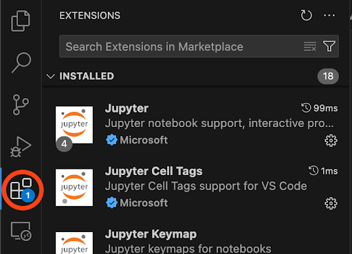
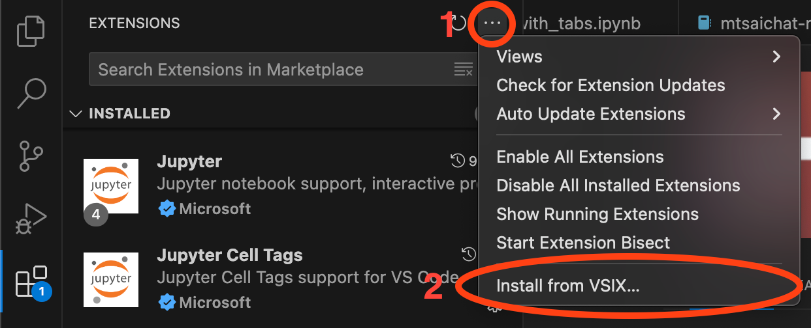
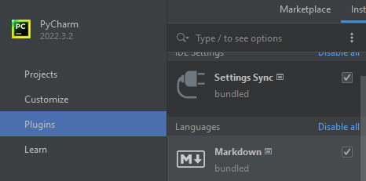
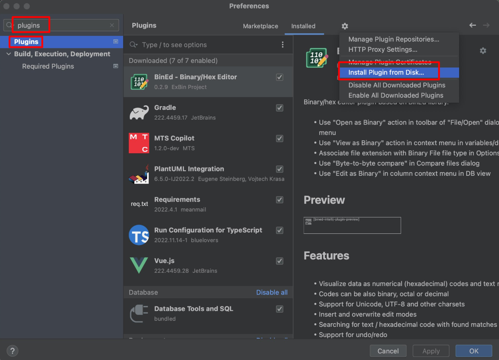

# Перечень терминов

- **Искусственный интеллект** – область компьютерных наук, занимающаяся созданием вычислительных систем, способных выполнять задачи, требующие человеческого интеллекта, такие как восприятие, рассуждение, обучение и решение проблем.
- **Машинное обучение** – раздел искусственного интеллекта, в котором вычислительные системы обучаются выполнять задачи, анализируя и обобщая данные. Обучение происходит без явного программирования специфических инструкций.
- **Нейронная сеть** – математическая модель, состоящая из взаимосвязанных искусственных нейронов, организованных в слои, предназначенная для выполнения задач машинного обучения и обработки данных.
- **Токен** – минимальная единица текста, например, слово или символ. Применяется в обработке естественного языка для анализа и генерации текста.

# Перечень сокращений

- **JSON (JavaScript Object Notation)** – лёгкий формат обмена данными. Формат легко читается человеком и парсируется компьютером.
- **NLP** – область искусственного интеллекта, занимающаяся взаимодействием между компьютерами и людьми на естественных языках, таких как русский или английский.
- **AI (Artificial Intelligence)** – это интеллект, демонстрируемый машинами, в частности компьютерными системами.
- **ПО** – программное обеспечение.
- **LLM (Large Language Model)** – это языковая модель, состоящая из нейронной сети со множеством параметров.
- **UI (User Interface)** – пользовательский интерфейс.
- **IDE (Integrated Development Environment)** - программа, в которой разработчики пишут, проверяют, тестируют и запускают код, а также ведут большие проекты.

# Введение

Настоящий документ представляет собой руководство пользователя (далее руководство) системы Kodify.

Руководство описывает:
- общее определение системы;
- функции системы;
- настройку и установку плагина в среде Visual Studio Code;
- настройку и установку плагина в среде JetBrains;
- работу с плагином.

## Краткое описание возможностей

Kodify от МТС AI представляет собой AI-ассистента разработчика. Этот инструмент использует искусственный интеллект для автоматизации рутинных процессов и помощи разработчикам в выполнении различных задач при написании программного кода. 

Функции Kodify:

- Автопродление кода с помощью LLM, которая на основе уже написанного пользователем кода генерирует завершение строки.
- Документирование кода
- Поиск ошибок в коде и исправление найденных ошибок.
- Формирование Unit-тестов для кода пользователя.
- Объяснение кода.

## Уровень подготовки пользователей

Пользователи Системы должны:

- обладать базовыми навыками работы в IDE в средах Visual Studio Code или JetBrains; 
- знать один из популярных языков программирования (например, Python, C#, Java, Go, JavaScript).

## Перечень эксплуатационной документации, с которой необходимо ознакомиться пользователю

Для работы в Системе, пользователь должен ознакомиться с настоящим руководством.

# Назначение и условия применения

Система предназначена для облегчения процесса разработки, предоставляя инструменты для генерации кода, улучшения его качества и автоматизации рутинных задач. Kodify поддерживает различные языки программирования (например, Python, C#, Java, Go, JavaScript) и интеграции с популярными инструментами разработки.

Kodify представляет собой LLM и плагин, встраиваемый в IDE. Взаимодействие пользователя с LLM Kodify осуществляется через пользовательский интерфейс (UI) в виде плагина. Плагин содержит набор функций для упрощения и ускорения процесса написания кода за счёт обращения к LLM. Плагин доступен для Visual Studio Code и JetBrains IDE's.

# Подготовка к работе

## Установка плагина в среде Visual Studio Code

> Поддерживаются среды разработки Visual Studio Code и IntelliJ IDEA.

1. Скачайте последнюю версию плагина Kodify для Visual Studio Code. Ссылку для скачивания предоставит сотрудник МТС ИИ.
2. Перейдите в раздел **"Extensions"** на левой панели инструментов.

   

3. В диалоговом меню выберите пункт **"Install from VSIX…"** и укажите скачанный файл плагина.

   

 ## Установка плагина в среде JetBrains

1. Скачайте последнюю версию плагина Kodify для JetBrains. Ссылку для скачивания предоставит сотрудник МТС ИИ.
2. Запустите IDE и перейдите в настройки IDE.
3. Напишите в поиске plugins или выберите пункт "Plugins" для перехода в настройку плагинов.

   

4. Нажмите на шестеренку в правом верхнем углу и выберите **"Install Plugin from Disk…"**.

   

5. Выберите скачанный файл с плагином.
6. Подтвердите перезагрузку IDE после установки. Нажмите **"Restart IDE"**.

## Настройка плагина в средах Visual Studio Code и JetBrains

