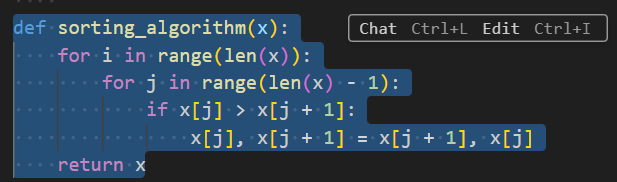

# Перечень терминов

- **Искусственный интеллект** – область компьютерных наук, занимающаяся созданием вычислительных систем, способных выполнять задачи, требующие человеческого интеллекта, такие как восприятие, рассуждение, обучение и решение проблем.
- **Машинное обучение** – раздел искусственного интеллекта, в котором вычислительные системы обучаются выполнять задачи, анализируя и обобщая данные. Обучение происходит без явного программирования специфических инструкций.
- **Нейронная сеть** – математическая модель, состоящая из взаимосвязанных искусственных нейронов, организованных в слои, предназначенная для выполнения задач машинного обучения и обработки данных.
- **Токен** – минимальная единица текста, например, слово или символ. Применяется в обработке естественного языка для анализа и генерации текста.

# Перечень сокращений

- **JSON (JavaScript Object Notation)** – лёгкий формат обмена данными. Формат легко читается человеком и парсируется компьютером.
- **NLP** – область искусственного интеллекта, занимающаяся взаимодействием между компьютерами и людьми на естественных языках, таких как русский или английский.
- **AI (Artificial Intelligence)** – это интеллект, демонстрируемый машинами, в частности компьютерными системами.
- **ПО** – программное обеспечение.
- **LLM (Large Language Model)** – это языковая модель, состоящая из нейронной сети со множеством параметров.
- **UI (User Interface)** – пользовательский интерфейс.
- **IDE (Integrated Development Environment)** - программа, в которой разработчики пишут, проверяют, тестируют и запускают код, а также ведут большие проекты.

# Введение

Настоящий документ представляет собой руководство пользователя (далее руководство) системы Kodify.

Руководство описывает:
- общее определение системы;
- функции системы;
- настройку и установку плагина в среде Visual Studio Code;
- настройку и установку плагина в среде JetBrains;
- работу с плагином.

## Краткое описание возможностей

Kodify от МТС AI представляет собой AI-ассистента разработчика. Этот инструмент использует искусственный интеллект для автоматизации рутинных процессов и помощи разработчикам в выполнении различных задач при написании программного кода. 

Функции Kodify:

- Автопродление кода с помощью LLM, которая на основе уже написанного пользователем кода генерирует завершение строки.
- Документирование кода
- Поиск ошибок в коде и исправление найденных ошибок.
- Формирование Unit-тестов для кода пользователя.
- Объяснение кода.

## Уровень подготовки пользователей

Пользователи Системы должны:

- обладать базовыми навыками работы в IDE в средах Visual Studio Code или JetBrains; 
- знать один из популярных языков программирования (например, Python, C#, Java, Go, JavaScript).

## Перечень эксплуатационной документации, с которой необходимо ознакомиться пользователю

Для работы в Системе, пользователь должен ознакомиться с настоящим руководством.

# Назначение и условия применения

Система предназначена для облегчения процесса разработки, предоставляя инструменты для генерации кода, улучшения его качества и автоматизации рутинных задач. Kodify поддерживает различные языки программирования (например, Python, C#, Java, Go, JavaScript) и интеграции с популярными инструментами разработки.

Kodify представляет собой LLM и плагин, встраиваемый в IDE. Взаимодействие пользователя с LLM Kodify осуществляется через пользовательский интерфейс (UI) в виде плагина. Плагин содержит набор функций для упрощения и ускорения процесса написания кода за счёт обращения к LLM. Плагин доступен для Visual Studio Code и JetBrains IDE's.

# Подготовка к работе

## Установка плагина в среде Visual Studio Code

> Поддерживаются среды разработки Visual Studio Code и IntelliJ IDEA.

1. Скачайте последнюю версию плагина Kodify для Visual Studio Code. Ссылку для скачивания предоставит сотрудник МТС ИИ.
2. Перейдите в раздел **"Extensions"** на левой панели инструментов.
   
   

3. В диалоговом меню выберите пункт **"Install from VSIX…"** и укажите скачанный файл плагина.
   
   

 ## Установка плагина в среде JetBrains

1. Скачайте последнюю версию плагина Kodify для JetBrains. Ссылку для скачивания предоставит сотрудник МТС ИИ.
2. Запустите IDE и перейдите в настройки IDE.
3. Напишите в поиске plugins или выберите пункт "Plugins" для перехода в настройку плагинов.
   
   

4. Нажмите на шестеренку в правом верхнем углу и выберите **"Install Plugin from Disk…"**.
   
   

5. Выберите скачанный файл с плагином.
6. Подтвердите перезагрузку IDE после установки. Нажмите **"Restart IDE"**.

## Настройка плагина в средах Visual Studio Code и JetBrains

1. Откройте в IDE любой файл.
2. Откройте боковую панель Kodify, используя следующую комбинацию клавиш:
  - в Visual Studio Code - **"CTRL + L"** (**"CMD + L"** на Mac);
  - в JetBrains - **"CTRL+ J"** (**"CMD + J"** на Mac).

    На следующем скриншоте показана боковая панель "Kodify" в Visual Studio Code.
    
       

    Боковая панель "Kodify" в JetBrains выглядит следующим образом:    
    
    

3. Откройте конфигурационный файл *config.json* одним из следующих способов:

   **Способ 1**

   На боковой панели Kodify нажмите на кнопку **"Open Settings"** в Visual Studio Code
   
    

   или **"Kodify Сonfig"** в JetBrains.
   
    
   
   В разделе Configuration для Chat настроек нажмите кнопку **"Open Config File"**.
   
    

   **Способ 2**

   На боковой панели, раскройте меню Kodify и нажмите на кнопку **"Open Settings"** (шестеренка).
   
    
  
   > После установки плагина Kodify, в IDE JetBrains могут быть неактивны кнопки открытия конфигурационного файла *config.json*. Для изменения состояния этих кнопок, переключите фокус с IDE, нажав **"Alt+Tab"**. Затем, верните фокус обратно в IDE. Нажмите снова **"Alt+Tab"**.

4. Заполните конфигурационный файл *config.json*.
Если вы планируете обращаться к Kodify в контуре МТС ИИ, то в конфигурационном файле для плагина вам необходимо указать **baseUrl** (адрес сервера, к которому вы будете обращаться) и **токен**, который будет использоваться плагином при отправке API-запросов к серверу. Для получения **baseUrl** и **токена** обратитесь к сотруднику МТС ИИ.

   **baseUrl** и **токен** требуется указать трижды:
  - в разделе **"models"** - поля **"apiBase"** и **"apiKey"**;
  - в разделе **"tabAutocompleteModel"** - поля **"apiBase"** и **"apiKey"**;
  - в разделе **"embeddingsProvider"** - поля **"apiBase"** и **"apiKey"**.

    Если в контуре вашей компании развёрнут отдельный экземпляр Kodify, то помимо **baseUrl** и **токена** вам потребуется заполнить в конфигурационном файле поле **"model"** (id модели) в следующих разделах:
  - в разделе **"models"**;
  - в разделе **"tabAutocompleteModel"**;
  - в разделе **"embeddingsProvider"**.

5. Сохраните настройки файла *config.json* в IDE. Для этого, нажмите комбинацию клавиш **"Ctrl+S"** или выберите пункт меню IDE: **File** -> **Save**.

# Работа с плагином 

> Плагин настроен и готов к работе. Сервис подключится автоматически (при необходимости перезагрузите IDE). 

## Автоматическое дополнение кода

Функция автодополнение кода предлагает вероятный вариант продолжения кода по мере его ввода пользователем в редакторе кода IDE.

1. Откройте любой файл с Python-кодом или иным языком программирования.
2. Поставьте курсор, например, после **"for i in range(len(x)):"** (смотрите скриншот ниже) и нажмите **ENTER**. Kodify предложит вариант дополнения кода.
   
   

3. Нажмите **TAB**, чтобы принять предложенное дополнение кода.
   
    

4. Если требуется продолжить автодополнение, нажмите **ENTER** еще раз и повторите шаг 3.

   Если возникли проблемы при установке или настройке, пожалуйста, свяжитесь с нами удобным способом, и мы обязательно поможем.

## Функциональность помощника разработчика

Kodify помогает разработчикам получить справочную информацию о выделенном коде, не покидая IDE.

1. Откройте файл с кодом и выделите требуемую часть кода. Плагин предложит нажать комбинацию клавиш:
- в Visual Studio Code - **"Ctrl+L"** для Windows или **"CMD + L"** для Mac;
- в JetBrains - **"Ctrl+J"** для Windows или **"CMD + J"** для Mac.

  

2. В открывшемся окне введите знак **"/"**. Появятся доступные варианты:
- **/docs** - добавляет docstring к выделенной части кода;
- **/test** - генерирует Unit-test к выделенной части кода;
- **/fix** - ищет и исправляет ошибки в выделенной части кода;
- **/explain (rus)** - объясняет что делает код на русском языке.

  

  Также, вместо использования одного из преднастроенных вариантов, вы можете самостоятельно описать те действия, которые Kodify должен будет произвести с выделенной частью кода.

3. Выберите нужный вам вариант или опишите собственный и нажмите на кнопку отправки или **ENTER**.
  
   

   После отправки пользователем соответствующего запроса, Kodify выдаст ответ. 

   На следующем скриншоте показан фрагмент ответа на вариант **"/explain  (rus)"**:
   
   

Вы можете применить вариант от Kodify, используя следующие кнопки (действия) на панели с вариантом:
- **Apply** - применяет вариант от Kodify к выделенному коду.
   
   

- **Insert at cursor** - применяет вариант от Kodify к месту в коде, где стоит курсор. 
- **Copy** - копирует вариант от Kodify в буфер.
- **Delete** - удаляет вариант от Kodify.
  
   

- **Helpful** и **Unhelpful** - помечают предложенный вариант как лайк или дизлайк.

### Вызов функции "Объяснение кода" через меню "Quick Fix"